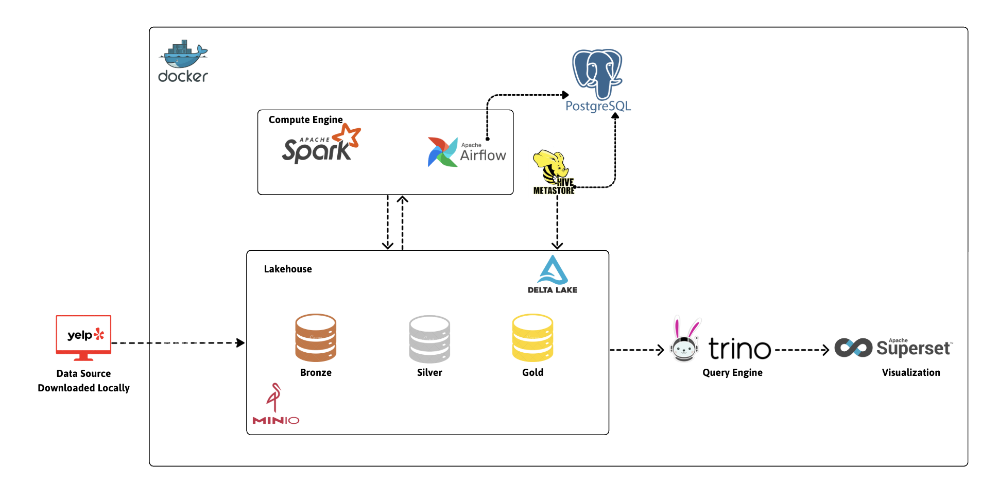
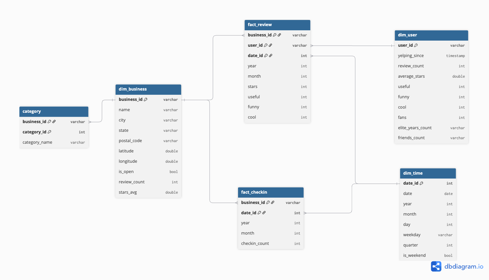
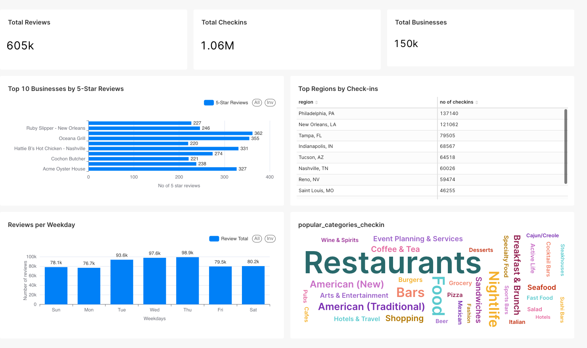

# Yelp Data Pipeline
A modular, ACID-compliant data pipeline that ingests the public [Yelp Dataset](https://www.yelp.com/dataset) into MinIO (S3-compatible), processes it with Apache Spark & Delta Lake, catalogs metadata in Hive Metastore, serves queries via Trino, enforces quality via Great Expectations, and orchestrates tasks with Airflow.

## Data Flow Diagram

## Key Features
- Automated monthly ETL transforms raw Yelp JSON into a reliable Gold layer, powering consistent analytics reports every month.  
- Scalable Spark compute and MinIO storage grow seamlessly as data volumes increase.  
- Delta Lake’s ACID transactions and time travel guarantee that each month’s snapshot is accurate and reproducible.  
- Airflow schedules, retries and monitors the entire monthly pipeline for end-to-end reliability. 

## Data Model

## Dashboard 

## Furrther Action
- **Integrate Great Expectations**  
  Add a dedicated GE checkpoint after the Bronze→Silver job to enforce data quality check

- **Deploy Grafana dashboards**  
  Collect Airflow, Spark and Delta Lake metrics (via Prometheus/JMX) and visualize DAG runtimes, executor utilization, shuffle/read/write throughput and storage growth.

- **Implement a Delta Lake ingestion layer**  
 
